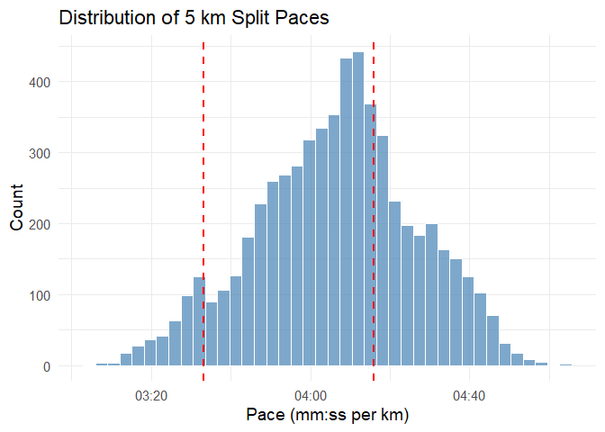
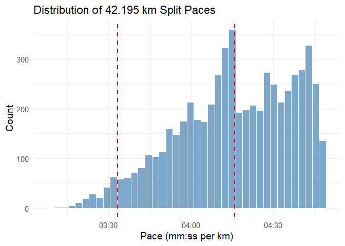
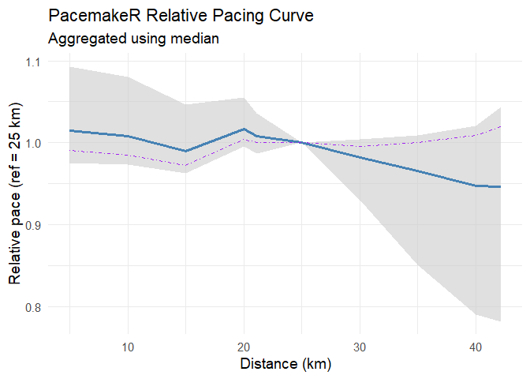
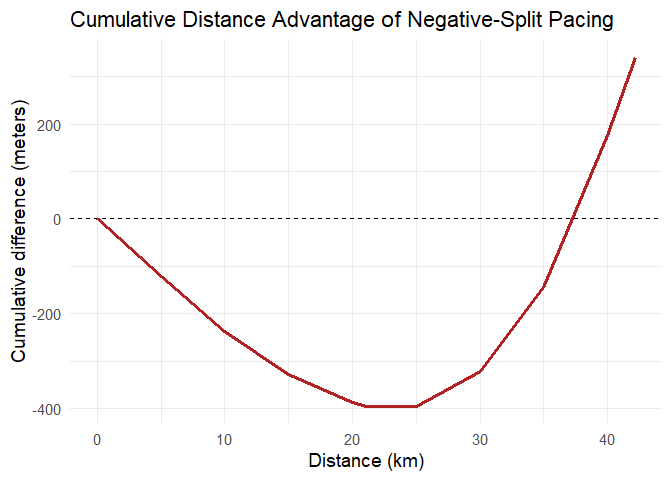
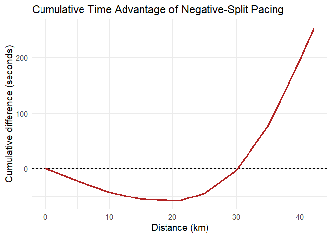

<!-- README.md is generated from README.Rmd. Please edit that file -->

# PacemakeR

<!-- badges: start -->

<!-- badges: end -->

PacemakeR is an R package for analysing pacing strategies in major
marathon races, such as London or Berlin. It provides simple tools to
analyse marathon split data, compute paces, summarise how runners
distribute their effort over the race, and quantify the advantage of one
pacing strategy over another. It is built as a proper R package —
`roxygen2` documentation, a generated `NAMESPACE`, declared
dependencies, a bundled dataset, and a `testthat` suite — and developed
under version control on
[GitHub](https://github.com/Runandecon/PacemakeR), from which it
installs directly.

## Introduction

In marathon running, a *negative split* means covering the second half
of the race faster than the first. It is widely regarded as the hallmark
of mastery, showcasing discipline and precision, and the latest world
records have been set this way — reflecting the delicate balance between
conserving energy early and maximising output late. For any
marathon-running economist (like me), this naturally becomes an
optimization problem: start too slowly and you under-use your
physiological budget; start too fast and you collapse under nonlinear
fatigue constraints (the most common outcome, known as “hitting the
wall”).

Whether negative splitting or even splitting should be the goal is a
matter of debate. The negative-split approach is essentially risk
minimization: it lets you start conservatively and minimise blow-up
risk, assuming you can set a realistic goal. On a good day you negative
split and reach the target; on a bad day you miss the dream target but
still even split. Since marathon performance comes down to months and
years of training, chance plays only a minor role, and there is rarely a
“surprise” performance outside a fairly predictable range.

This package analyses marathon split data through that lens. It
evaluates a runner’s pacing relative to the rest of the field, which
filters out external factors such as weather, temperature, or course
features like a hill at kilometre 18. This comparative approach gives a
cleaner read on pacing and lets us describe the strategy the data
actually rewards.

### A few running terms, briefly

For readers who have never run a marathon, three terms are worth
defining up front, since everything below is built on them:

- **Distance.** A marathon is 42.195 km.
- **Splits** are recorded by races as the the elapsed time between fixed
  checkpoints (timing mats) along the course, e.g. at 5 km, 10 km, the
  half (21.1 km), and so on.
- **Pace.** Speed expressed as time per kilometre, written `mm:ss`
  (e.g. a pace of `04:30` means four minutes thirty seconds per km).
  Lower pace = faster. Pace is just the inverse of speed, scaled to the
  units runners actually think in.

## Installation

You can install the development version of PacemakeR from
[GitHub](https://github.com/Runandecon/PacemakeR) with:

``` r
# install.packages("devtools")
devtools::install_github("Runandecon/PacemakeR")
library(PacemakeR)
```

## The data

The package ships with `London_Marathon_2026`, the official split-level
results of the fastest 6000 amateur men in the 2026 London Marathon,
scraped from the official results site. Each row is one runner at one
timing mat — the standard way race results are published — which makes
it *long-format* data: many rows per runner.

Marathon results in the wild are messy: missing splits, runners who
dropped out, times recorded as blanks or `DNF`. Before any analysis is
possible the data has to be reshaped from this long format into one tidy
pacing table per runner and cleaned of those invalid entries. The
package does this with a **tidyverse** (`dplyr` / `tibble`) pipeline
grouping by runner, ordering splits, and differencing successive times
into segment paces. This is the data-manipulation backbone everything
downstream relies on.

    #> S7    (0.2.1 -> 0.2.2) [CRAN]
    #> dplyr (1.2.0 -> 1.2.1) [CRAN]
    #> package 'S7' successfully unpacked and MD5 sums checked
    #> package 'dplyr' successfully unpacked and MD5 sums checked
    #> 
    #> The downloaded binary packages are in
    #>  C:\Users\Julia\AppData\Local\Temp\Rtmpq2qn1k\downloaded_packages
    #> ── R CMD build ─────────────────────────────────────────────────────────────────
    #>       ✔  checking for file 'C:\Users\Julia\AppData\Local\Temp\Rtmpq2qn1k\remotes9d8c54c488f\Runandecon-PacemakeR-39f7b9f/DESCRIPTION' (1s)
    #>       ─  preparing 'PacemakeR':
    #>    checking DESCRIPTION meta-information ...  ✔  checking DESCRIPTION meta-information
    #>       ─  checking for LF line-endings in source and make files and shell scripts (855ms)
    #>   ─  checking for empty or unneeded directories
    #>        NB: this package now depends on R (>= 3.5.0)
    #>      WARNING: Added dependency on R >= 3.5.0 because serialized objects in
    #>      serialize/load version 3 cannot be read in older versions of R.
    #>      File(s) containing such objects:
    #>        'PacemakeR/data/London_Marathon_2026.rda'
    #>      NB: this package now depends on R (>=        NB: this package now depends on R (>= 4.1.0)
    #>      WARNING: Added dependency on R >= 4.1.0 because package code uses the
    #>      pipe |> or function shorthand \(...) syntax added in R 4.1.0.
    #>      File(s) using such syntax:
    #>        'processing.R'
    #> ─  building 'PacemakeR_0.1.0.tar.gz'
    #>      
    #> 

``` r
data("London_Marathon_2026")
head(London_Marathon_2026)
#>              Name Nationality  Bib Distance     Time
#> 1 Grassly, George         GBR 2129   5.0000 00:15:22
#> 2 Grassly, George         GBR 2129  10.0000 00:30:49
#> 3 Grassly, George         GBR 2129  15.0000 00:46:28
#> 4 Grassly, George         GBR 2129  20.0000 01:01:51
#> 5 Grassly, George         GBR 2129  21.0975 01:05:16
#> 6 Grassly, George         GBR 2129  25.0000 01:17:30
```

The columns are `Name`, `Nationality`, `Bib` (the runner’s id number),
`Distance` (the split distance in km), and `Time` (elapsed time at that
split, as `hh:mm:ss`).

## The functions

The functions build on each other: describe the field, distil its pacing
strategy, and price the payoff of running it well. Each one also leans
on a particular tool from the course, introduced where it does its work.

### `marathon_summary()` — describe the field

`marathon_summary()` reduces the field to a five-number summary (mean,
median, min, max, standard deviation) of either finishing times or any
intermediate split. It can report this in **time** (`hh:mm:ss`) or in
**pace** (`mm:ss` per km), and can draw the distribution.

For an econometrician: this is the descriptive-statistics step — what
does the distribution of outcomes look like, and where would a given
target sit within it? The distribution plot is the package’s first use
of **ggplot2**, which handles all visualisation here. On top of the
histogram it overlays vertical reference markers; the two below mark a
2:30 and a 3:00 finish (elite-amateur and strong-amateur benchmarks),
which the function converts automatically from a finish time into the
pace it implies, so a target on the time scale lines up correctly on the
pace axis.

``` r
marathon_summary(London_Marathon_2026)
#> # A tibble: 5 × 3
#>   metric seconds formatted
#>   <chr>    <dbl> <chr>    
#> 1 mean    10800. 03:00:00 
#> 2 median  10816  03:00:16 
#> 3 min      7974  02:12:54 
#> 4 max     12148  03:22:28 
#> 5 sd        882. 00:14:42
```

``` r
marathon_summary(London_Marathon_2026, distance = 5, pace = TRUE, plot = TRUE, markers = c("02:30:00", "03:00:00"))
```



    #> # A tibble: 5 × 3
    #>   metric seconds formatted
    #>   <chr>    <dbl> <chr>    
    #> 1 mean     246.  04:06    
    #> 2 median   248.  04:08    
    #> 3 min      184.  03:04    
    #> 4 max      304.  05:04    
    #> 5 sd        20.1 00:20

    marathon_summary(London_Marathon_2026, plot = TRUE, markers = c("02:30:00", "03:00:00"))



    #> # A tibble: 5 × 3
    #>   metric seconds formatted
    #>   <chr>    <dbl> <chr>    
    #> 1 mean    10800. 03:00:00 
    #> 2 median  10816  03:00:16 
    #> 3 min      7974  02:12:54 
    #> 4 max     12148  03:22:28 
    #> 5 sd        882. 00:14:42

### `pacemaker()` — distil the strategy

`pacemaker()` is the analytical core. For every runner it builds a
*relative-pace curve*: their pace at each split, normalised so that a
chosen reference split equals 1. Normalising this way is what makes a
fast and a slow runner comparable on the same axis — it strips out
absolute speed and leaves only the *shape* of the effort, i.e. where
each runner spent or conserved energy. The function then aggregates
these curves across the whole field, with a quantile band for the
spread, and separately averages the runners who ran a negative split,
overlaying them for comparison.

For the econometrician: each runner’s curve is an index normalised to a
base period (the reference split), exactly like a price index normalised
to a base year. Values above 1 mean “faster than the reference,” below 1
“slower.” The aggregate curve is the field’s average index path; the
band is its empirical spread.

This is where the package’s use of **S3 classes** comes in. Rather than
handing back a bare list of numbers, `pacemaker()` returns an object of
a custom class, `pacemaker`, that bundles the curve, the
cumulative-advantage data, and metadata about the fit. Defining a class
lets the package give the object its own `print` and `plot` methods, so
it behaves like a first-class R object: typing its name dispatches to
`pacemaker_print`, which lays out the pacing progression as a table, and
calling `plot()` dispatches to `pacemaker_plot`, which draws the curve.
The single object is the whole analysis — everything you might want to
see is computed once and read off it on demand.

``` r
london <- pacemaker(London_Marathon_2026, relative = 21.0975)
class(london)
#> [1] "pacemaker"
```

``` r
print(london)
#> <pacemaker> pacing analysis
#>   Reference split : 21.0975 km
#>   Runners used    : 6027
#>   Aggregated by   : mean
#> 
#>  Distance Rel_pace Change Neg_split
#>    5.0000    1.013     NA     0.996
#>   10.0000    1.006 -0.007     0.990
#>   15.0000    0.986 -0.020     0.977
#>   20.0000    1.011  0.025     1.009
#>   21.0975    1.000 -0.011     1.000
#>   25.0000    0.992 -0.008     1.004
#>   30.0000    0.969 -0.023     1.000
#>   35.0000    0.945 -0.024     1.004
#>   40.0000    0.925 -0.020     1.013
#>   42.1950    0.927  0.001     1.023
plot(london)
```



### `plot(opt, "gain")` — price the payoff

Because the analysis lives in one `pacemaker` object, pricing the
strategy is just another view of it rather than a separate function. The
object also stores the *gain*: the cumulative advantage a negative-split
runner builds over the field across the race. Asking its `plot` method
for the `"gain"` view integrates the gap between the two curves along
the course and reports it either as distance (metres ahead) or, given a
reference pace, as time saved — the same S3 `plot` method, switched to a
different output.

For the econometrician: this is the cumulative integral of the
per-segment difference between two index paths — the running total of
how far ahead the negative-split strategy puts you, expressed in units a
runner cares about.

``` r
plot(london, "gain")                                   # advantage in metres
```



``` r
plot(london, "gain", unit = "time", pace_sec = 255)    # same advantage, in seconds
```



## Course tools at a glance

The tools above were each introduced where they do their work: version
control and the package skeleton frame the whole project; the
**tidyverse** pipeline reshapes and cleans the raw splits; **ggplot2**
carries every visualisation; and a custom **S3 class** turns the central
`pacemaker()` result into an object that prints and plots itself. The
package is tracked on GitHub, documented with `roxygen2`, and validated
by a `testthat` suite covering the helpers, the core computation, and
the S3 methods, so `devtools::check()` passes from a clean environment.

## Notes on reproducibility

This `README.md` is generated from `README.Rmd`; re-render it with
`devtools::build_readme()` whenever the source changes, and commit the
resulting figures in `man/figures/` so they display on GitHub.
